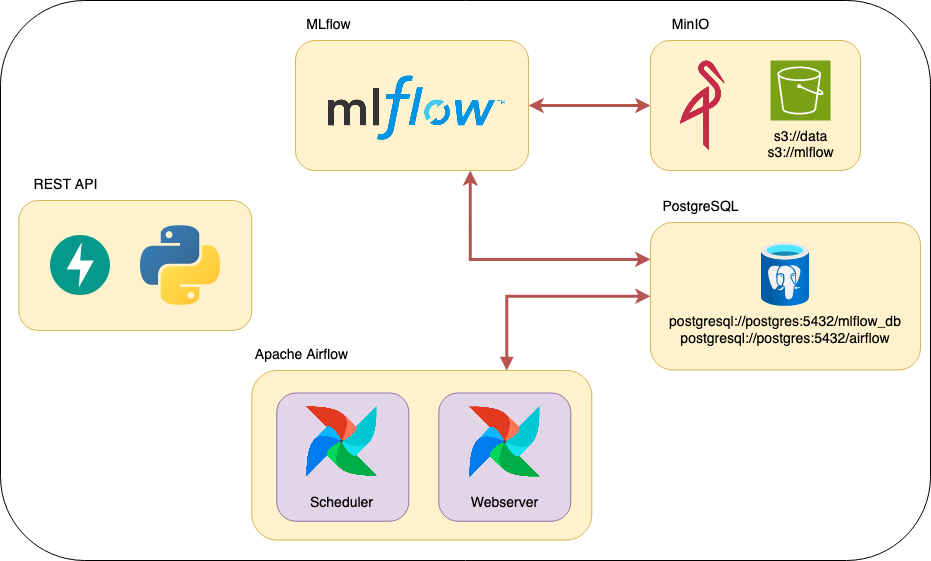

# Bienvenido a PreciosProAI

¿Estás buscando tu primera casa para independizarte, pero no tienes idea de cuál es el precio justo para lo que buscas? ¿No sabes qué precio ponerle a tu apartamento heredado? ¿O quizás estás buscando una buena oportunidad para invertir en un inmueble para el futuro? ¡Llegaste al lugar indicado!

<div style="text-align: center;">
    
</div>

## Sobre PreciosProAI

### ¿Quiénes somos?

PreciosProAI es una innovadora startup fundada por un grupo de cinco estudiantes del posgrado en CEIA que están cursando la materia Aprendizaje de Máquinas II: Fabricio Denardi, Mauro Aguirregaray, Alan Perez, Sofia Speri y Cristian Davico. Motivados por la pregunta de si, a partir de una lista pequeña de entradas, se podría predecir el precio de una vivienda, este equipo se propuso crear una solución que ayude a personas inexpertas en el mercado inmobiliario.

<div style="text-align: center;">
    
    <p><em>Foto a modo ilustrativo del equipo de trabajo</em></p>
</div>

### Nuestra Misión

En PreciosProAI, nuestra misión es proporcionar **estimaciones precisas para decisiones fáciles**. Creemos que con la ayuda de algoritmos de machine learning y una interfaz fácil de usar, podemos simplificar la compleja tarea de evaluar precios de propiedades, ayudando tanto a compradores primerizos como a inversionistas experimentados a tomar decisiones informadas.

## ¿Qué datos necesito para poder usar PreciosPro AI?

Para obtener una predicción precisa con PreciosPro AI, necesitarás proporcionar la siguiente información sobre el inmueble:

* **Monto de Expensas en ARS:** El valor mensual de las expensas.
* **Metros Totales del Inmueble en m²:** La superficie total, incluyendo áreas cubiertas y descubiertas.
* **Metros Cubiertos en m²:** La superficie construida. Si el inmueble no tiene áreas descubiertas, este valor será igual al total de metros.
* **Cantidad de Habitaciones:** El número total de habitaciones en la propiedad.
* **Cantidad de Dormitorios:** El número de dormitorios específicos.
* **Cantidad de Baños:** Incluye tanto baños completos como medios baños.
* **Cantidad de Cocheras:** El número de espacios de estacionamiento disponibles.
* **Antigüedad de la Propiedad en años:** El tiempo transcurrido desde la construcción de la propiedad.

*Nota: Te invitamos a probar el modelo ingresando los datos de tu propia vivienda.*

## ¿Cómo funciona PreciosPro AI?

PreciosPro AI es una implementación basada en los ejemplos de la materia CEIA AMq2. Utiliza Docker y Docker Compose para desplegar múltiples contenedores que representan diferentes servicios en un entorno productivo. Estos servicios trabajan en conjunto para procesar datos y generar predicciones (ver .env).

Los servicios que forman parte de PreciosPro AI son:
- **[Apache Airflow](https://airflow.apache.org/):** Orquestación de flujos de trabajo.
- **[MLflow](https://mlflow.org/):** Gestión del ciclo de vida de los modelos de machine learning.
- **API REST con [FastAPI](https://fastapi.tiangolo.com/):** Para servir los modelos y responder a solicitudes.
- **[MinIO](https://min.io/):** Almacenamiento de objetos compatible con S3.
- **Base de datos relacional [PostgreSQL](https://www.postgresql.org/):** Para gestionar y almacenar datos estructurados.



Vamos a trabajar con el dataset `./data/train_data.xlsx`, que toma valores de la página [ZonaProp](https://www.zonaprop.com.ar) de propiedades de Capital Federal.

## ¿Cómo uso PreciosPro AI?

¡Ya quedan los últimos pasos para poder usar inteligencia artificial y estimar el precio de tu vivienda! Pero paciencia, primero vamos a asegurarnos de que todo funcione correctamente.

1. **Entorno Virtual:**
   - Recomendamos el uso de Poetry para la creación del entorno virtual. En este repositorio encontrarás el archivo `pyproject.toml`, que asegura que todas las dependencias y versiones de las librerías usadas funcionen correctamente.

2. **Instalación de Docker:**
   - Para levantar todos los servicios, primero instala [Docker](https://docs.docker.com/engine/install/) en tu computadora (o en el servidor que desees usar).
   - **Nota para Windows:** Asegúrate de tener Docker Desktop ejecutándose mientras trabajas.

### Pasos para Configurar y Usar PreciosPro AI

1. **Clona este repositorio.**

2. **Configuración del entorno (Linux/MacOS):**
   - Si estás en Linux o MacOS, edita el archivo `.env` y reemplaza `AIRFLOW_UID` con el UID de tu usuario (puedes encontrarlo con el comando `id -u <username>`). Esto es necesario para evitar problemas de permisos con Apache Airflow.

3. **Levanta todos los servicios:**
   - En la carpeta raíz de este repositorio, ejecuta el siguiente comando (esto puede llevar unos minutos):
     ```bash
     docker compose --profile all up
     ```

4. **Verifica que todos los servicios están funcionando:**
   - Usa el comando `docker ps -a` para asegurarte de que todos los servicios estén en estado "healthy" o revisa en Docker Desktop.

5. **Accede a los servicios disponibles:**
   - Apache Airflow: [http://localhost:8080](http://localhost:8080)(Usuario: airflow, Password: airflow)
   - MLflow: [http://localhost:5005](http://localhost:5005)
   - MinIO (administración de buckets): [http://localhost:9001](http://localhost:9001)(Usuario: minio, Password: minio123)
   - Streamlit: [http://localhost:8501/](http://localhost:8501/)

6. **(Opcional) Ejecución de ETL en Airflow:**
   - En Apache Airflow, ejecuta el ETL haciendo clic en el botón de "play". Espera unos minutos hasta que se complete.

7. **(Opcional) Visualiza los archivos en MinIO:**
   - Ahora podrás visualizar en MinIO el bucket con los archivos que se utilizarán en el entrenamiento del modelo.

8. **Entrenamiento del modelo:**
   - Ejecuta el notebook entero dentro de la carpeta `./notebooks` para realizar el entrenamiento del modelo. Si no realizaste los puntos 6 y 7, desde el notebook podes ejecutar el ETL en airflow (primera celda de código).

9. **Visualización de resultados:**
   - Podrás visualizar en MLflow el modelo entrenado, junto con sus métricas más importantes, así como en MinIO.

10. **Predicción con tu vivienda:**
    - ¡Ya casi estás! Ahora entra en la API, llena los datos de tu inmueble, y haz clic en "Enviar".

## ¡Felicitaciones!

Si has seguido todos los pasos, ya estás utilizando el poder de la inteligencia artificial para estimar el precio de propiedades en Capital Federal. Gracias a PreciosPro AI, puedes analizar datos complejos y obtener predicciones precisas de manera sencilla y rápida.

¡Bienvenido al futuro de la valuación inmobiliaria con el poder de la IA en tus manos!

## Posibles problemas

### 1. Error al ejecutar Create Bucket
Si al intentar crear un bucket recibes el siguiente error:

```bash
minio_create_bucket  | /bin/sh: /etc/create_buckets.sh: /bin/sh: bad interpreter: Permission denied
```

#### Solución
Ejecuta el siguiente comando en una terminal para dar permisos de ejecución al script:

```bash
chmod +x create_buckets.sh
```

Este comando debe ser ejecutado en la carpeta `minio`.

---

### 2. Error al copiar Excel con datos
Si al intentar copiar un archivo Excel a un bucket obtienes el siguiente error:

```bash
minio_upload_file    | mc: <ERROR> Failed to copy /data/train_data.xlsx. Bucket data does not exist.
```

#### Solución
En la definición del volumen para el servicio `upload_file_to_s3` en el archivo `docker-compose.yml`, asegúrate de establecer la ruta absoluta del archivo Excel. Este error es más común en usuarios de Mac, donde Docker podría no encontrar la ruta o solicitar la adición de variables de entorno específicas.

Ejemplo:

```bash
- /Users/tu_usuario/Documents/CEIA/AMq2/TPs/AdM2-main/data/train_data.xlsx:/data/train_data.xlsx
```

Asegúrate de reemplazar `/Users/tu_usuario/` con la ruta correspondiente en tu sistema.

# Conclusiones

Más allá de que no nos hacemos responsables de las inversiones que puedan hacer los usuarios y que la empresa PreciosPro AI roza lo ilegal, creemos que este trabajo estuvo muy bueno. Poder poner en "producción" un modelo es una tarea que normalemente se deja de lado en cursos de Machine Learning y tener que levantar todos los servicios necesarios, conocerlos, luchar con ellos, creemos que es algo que nos puede ayudar mucho y diferenciar en el mercado laboral.