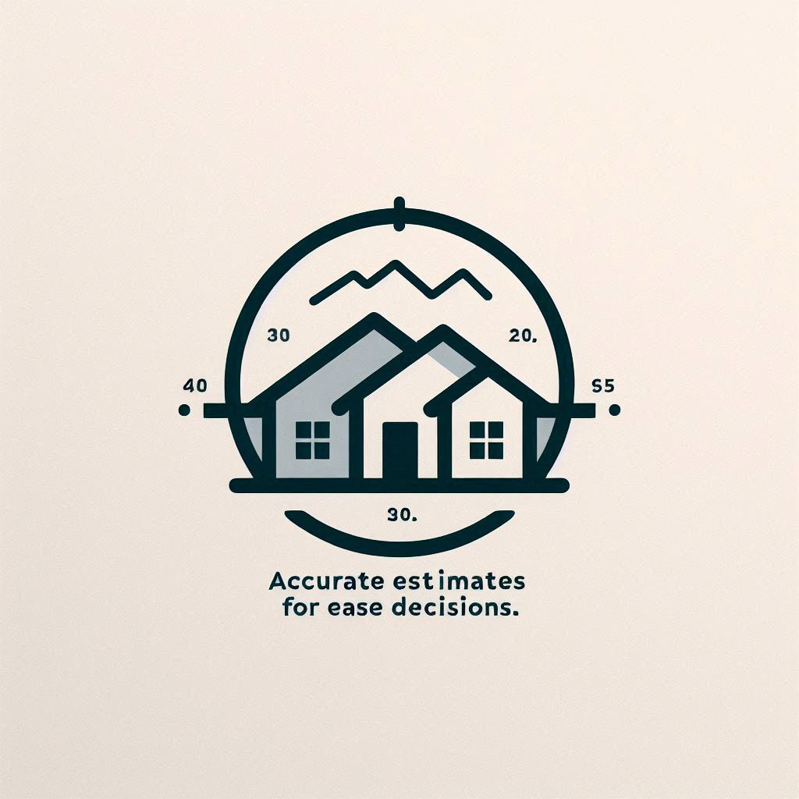
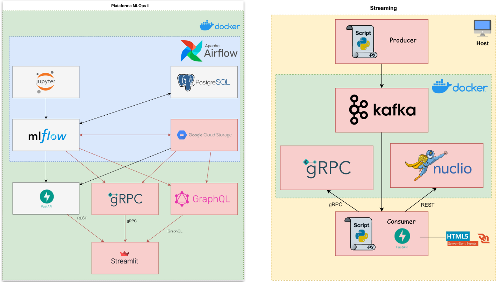
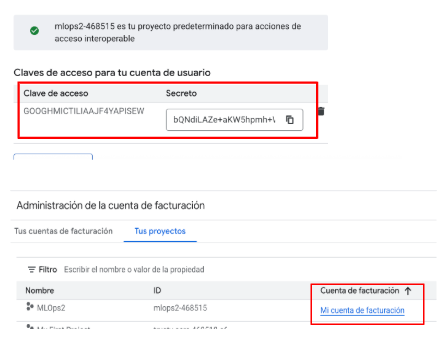

# Bienvenido a PreciosProAI 2

¿Estás buscando tu primera casa para independizarte, pero no tienes idea de cuál es el precio justo para lo que buscas? ¿No sabes qué precio ponerle a tu apartamento heredado? ¿O quizás estás buscando una buena oportunidad para invertir en un inmueble para el futuro? ¡Llegaste al lugar indicado!

<div style="text-align: center;">
    
</div>

## Sobre PreciosProAI 2

### ¿Quiénes somos?

PreciosProAI 2 es un proyecto innovador desarrollado por tres estudiantes del posgrado en CEIA/MIA (Fabricio Denardi, Bruno Masoller y Sofía Speri) en el marco de la materia MLOPS2. Surge como evolución de PreciosProAI, una primera versión que permitía, a partir de una pequeña lista de variables de entrada, predecir el precio de una vivienda.

En esta nueva versión, el producto no solo busca ayudar a personas con poca experiencia en el mercado inmobiliario a obtener una estimación más rápida y precisa del valor de su propiedad, sino que también incorpora la capacidad de detectar en tiempo real publicaciones que se encuentren por debajo del valor de mercado, facilitando así la identificación de oportunidades de inversión.

<div style="text-align: center;">
    
    <p><em>Foto a modo ilustrativo del equipo de trabajo</em></p>
</div>

### Nuestra Misión

En PreciosProAI, nuestra misión es proporcionar **estimaciones precisas para decisiones fáciles**. Creemos que con la ayuda de algoritmos de machine learning y una interfaz fácil de usar, podemos simplificar la compleja tarea de evaluar precios de propiedades, ayudando tanto a compradores primerizos como a inversionistas experimentados a tomar decisiones informadas.

## ¿Qué datos necesito para poder usar PreciosPro AI 2?

Para obtener una predicción precisa con PreciosPro AI 2, necesitarás proporcionar la siguiente información sobre el inmueble:

* **Monto de Expensas en ARS:** El valor mensual de las expensas.
* **Metros Totales del Inmueble en m²:** La superficie total, incluyendo áreas cubiertas y descubiertas.
* **Metros Cubiertos en m²:** La superficie construida. Si el inmueble no tiene áreas descubiertas, este valor será igual al total de metros.
* **Cantidad de Habitaciones:** El número total de habitaciones en la propiedad.
* **Cantidad de Dormitorios:** El número de dormitorios específicos.
* **Cantidad de Baños:** Incluye tanto baños completos como medios baños.
* **Cantidad de Cocheras:** El número de espacios de estacionamiento disponibles.
* **Antigüedad de la Propiedad en años:** El tiempo transcurrido desde la construcción de la propiedad.

*Nota: Te invitamos a probar el modelo ingresando los datos de tu propia vivienda.*

## ¿Cómo funciona PreciosPro AI 2?

PreciosPro AI 2 es una implementación basada en los conceptos vistos de la materia CEIA MLOPS2. Utiliza Docker y Docker Compose para desplegar múltiples contenedores que representan diferentes servicios en un entorno productivo. Estos servicios trabajan en conjunto para procesar datos y generar predicciones (ver .env).

Los servicios que forman parte de PreciosPro AI son:
- **[Apache Airflow](https://airflow.apache.org/):** Orquestación de flujos de trabajo (entrenamiento, versionado y despliegue).
- **[MLflow](https://mlflow.org/):** Gestión del ciclo de vida de los modelos de machine learning.
- **Base de datos relacional [PostgreSQL](https://www.postgresql.org/):** Para gestionar y almacenar datos estructurados.
- **API REST con [FastAPI](https://fastapi.tiangolo.com/):** Para servir los modelos y responder a solicitudes.
- **Google Cloud Storage (S3 API compatible):** Almacenamiento de objetos en la nube para datasets, artefactos y modelos.
- **Apache Kafka:** Sistema de mensajería distribuido para streaming de datos en tiempo real.
- **gRPC:** Protocolo de comunicación de alto rendimiento entre microservicios y backends.
- **GraphQL:** Interfaz flexible de consulta y mutación para clientes frontend y servicios.
- **Nuclio:** Framework de serverless functions para procesamiento de datos y ejecución de inferencias a gran escala.



Vamos a trabajar con el dataset `./data/train_data.xlsx`, que toma valores de la página [ZonaProp](https://www.zonaprop.com.ar) de propiedades de Capital Federal.

## ¿Cómo uso PreciosPro AI 2?

¡Ya quedan los últimos pasos para poder usar inteligencia artificial y estimar el precio de tu vivienda! Pero paciencia, primero vamos a asegurarnos de que todo funcione correctamente.

1. **Entorno Virtual:**
   - Recomendamos el uso de Poetry para la creación del entorno virtual. En este repositorio encontrarás el archivo `pyproject.toml`, que asegura que todas las dependencias y versiones de las librerías usadas funcionen correctamente.

2. **Instalación de Docker:**
   - Para levantar todos los servicios, primero instala [Docker](https://docs.docker.com/engine/install/) en tu computadora (o en el servidor que desees usar).
   - **Nota para Windows:** Asegúrate de tener Docker Desktop ejecutándose mientras trabajas.

### Pasos para Configurar y Usar PreciosPro AI 2

1. **Clona este repositorio.**

2. **Configuración del entorno (Linux/MacOS):**
   - Si estás en Linux o MacOS, edita el archivo `.env` y reemplaza `AIRFLOW_UID` con el UID de tu usuario (puedes encontrarlo con el comando `id -u <username>`). Esto es necesario para evitar problemas de permisos con Apache Airflow.

3. **Levanta todos los servicios:**
   - En la carpeta raíz de este repositorio, ejecuta el siguiente comando (esto puede llevar unos minutos):
     ```bash
     docker compose --profile all up
     ```

4. **Verifica que todos los servicios están funcionando:**
   - Usa el comando `docker ps -a` para asegurarte de que todos los servicios estén en estado "healthy" o revisa en Docker Desktop.

5. **Accede a los servicios disponibles:**
   - Apache Airflow: [http://localhost:8080](http://localhost:8080)(Usuario: airflow, Password: airflow)
   - MLflow: [http://localhost:5005](http://localhost:5005)
   - Google Cloud Platform: [https://console.cloud.google.com/](https://console.cloud.google.com/)
   - Streamlit: [http://localhost:8501/](http://localhost:8501/)

> [!IMPORTANT]  
> Deberías crear un bucket en Google Cloud Storage (GCS) para almacenar los archivos de entrenamiento y los modelos. Asegúrate de que el bucket tenga la política de acceso adecuada para que los servicios puedan interactuar con él. También existe un `docker-compose-minio.yml` que levanta un servicio de MinIO, compatible con la API de S3, para simular el almacenamiento en la nube. Si lo usas, asegúrate de cambiar las variables de entorno en el archivo `.env` para apuntar a MinIO. También deberías verificar que las rutas en las aplicaciones aputen a MinIO en lugar de GCS, puede que se nos haya pasado algún detalle 😁.

1. **(Opcional) Ejecución de ETL en Airflow:**
   - En Apache Airflow, ejecuta el ETL haciendo clic en el botón de "play". Espera unos minutos hasta que se complete.

2. **(Opcional) Visualiza los archivos en GoogleCloud:**
   - Ahora podrás visualizar en la plataforma de Google Cloud el bucket con los archivos que se utilizarán en el entrenamiento del modelo.

3. **Entrenamiento del modelo:**
   - Ejecuta el notebook entero dentro de la carpeta `./notebooks` para realizar el entrenamiento del modelo. Si no realizaste los puntos 6 y 7, desde el notebook podes ejecutar el ETL en airflow (primera celda de código).

4. **Visualización de resultados:**
   - Podrás visualizar en MLflow el modelo entrenado, junto con sus métricas más importantes, así como en el repositorio S3.

5.  **Predicción con tu vivienda:**
    - ¡Ya casi estás! Ingresa a la API, completa los datos de tu inmueble y haz clic en "Enviar".  
    - La predicción se realizará utilizando tres métodos de comunicación: **FastAPI** (heredado de la primera versión) y, como novedades de este año, **gRPC** y **GraphQL**.  
    - De esta forma podrás comparar en tiempo real el desempeño de cada protocolo y notar las diferencias en los tiempos de respuesta.

6.  **Encuentra tu próxima propiedad:**
   - Para ejecutar el flujo de streaming, seguí estos pasos:  
     1. Abrí una terminal y ubícate en la carpeta `streaming` del repositorio y activa el canal consumidor de la siguiente forma:  
        ```bash
        cd streaming/
        poetry run python consumer.py
        ```
        Cuando veas el mensaje en pantalla  
        ```
        Escuchando mensajes en el tópico 'appartment_data'...
        ```  
        significa que el consumidor está activo.  

     2. En otra terminal, repetí el procedimiento pero esta vez ejecutando el **productor**:  
        ```bash
        cd streaming/
        poetry run python producer.py
        ```
        Una vez activo, verás en pantalla las publicaciones encontradas a ser analizadas por el consumidor.  

     3. Al finalizar el proceso, se generará automáticamente un **archivo Excel** dentro del repositorio con todas las publicaciones seleccionadas, listas para analizar y aprovechar en tu próxima inversión inmobiliaria.

7. **(Opcional) Utilización de funciones serverless con Nuclio:**
   - Cuando realizaste `docker compose --profile all up`, se levantó un servicio de Nuclio. Puedes acceder a la interfaz de Nuclio en [http://localhost:8070](http://localhost:8070). Esta herramienta te permite crear funciones serverless que pueden ser utilizadas para realizar inferencias de modelos de machine learning de manera escalable y eficiente. Puedes crear una función que consuma el modelo entrenado y realice predicciones basadas en los datos de entrada. Ya existe una función de ejemplo en el repositorio.
   - Está todo configurado para que puedas probarlo mediante *streaming*. En vez de ejecutar el consumer *gRPC* del paso anterior, ejecuta el siguiente comando:
     ```bash
     poetry run python consumer_fastapi_websocket.py
     ```
   
   - Luego, en otra terminal (a parte del producer), ejecuta:
     ```bash
     curl localhost:8001/stream --no-buffer # No te olvides de tener el producer activo
     ```

> [!NOTE]  
> Esto lo que hace es establecer una conexión utilizando SSE (Server-Sent Events) para recibir actualizaciones en tiempo real desde el servidor. Puedes ver cómo se reciben los mensajes en tiempo real a medida que se procesan las publicaciones. Esto mismo se podría consumir desde un frontend, como una aplicación web o móvil, para mostrar las actualizaciones en tiempo real a los usuarios.

## ¡Felicitaciones!

Si has seguido todos los pasos, ya estás utilizando el poder de la inteligencia artificial para estimar el precio de propiedades en Capital Federal. Gracias a PreciosPro AI, puedes analizar datos complejos y obtener predicciones precisas de manera sencilla y rápida.

¡Bienvenido al futuro de la valuación inmobiliaria con el poder de la IA en tus manos!

## Posibles problemas

### 1. Activar y configurar proyecto en Google Cloud Services

Es necesario que cuentes con una cuenta de Google Cloud Services. Deberás por un lado, activar una cuenta de facturación para el proyecto, y por otro lado generar una cuenta de servicio HMAC:




### 2. Error al copiar Excel con datos
Si al intentar copiar un archivo Excel a un bucket obtienes el siguiente error:

```bash
minio_upload_file    | mc: <ERROR> Failed to copy /data/train_data.xlsx. Bucket data does not exist.
```

#### Solución
En la definición del volumen para el servicio `upload_file_to_s3` en el archivo `docker-compose.yml`, asegúrate de establecer la ruta absoluta del archivo Excel. Este error es más común en usuarios de Mac, donde Docker podría no encontrar la ruta o solicitar la adición de variables de entorno específicas.

Ejemplo:

```bash
- /Users/tu_usuario/Documents/CEIA/AMq2/TPs/AdM2-main/data/train_data.xlsx:/data/train_data.xlsx
```

Asegúrate de reemplazar `/Users/tu_usuario/` con la ruta correspondiente en tu sistema.

# Conclusiones

Más allá de que no nos hacemos responsables de las inversiones que puedan hacer los usuarios y que el proyecto PreciosPro AI 2 roza lo ilegal, creemos que este trabajo estuvo muy bueno. Poder poner en "producción" un modelo es una tarea que normalemente se deja de lado en cursos de Machine Learning y tener que levantar todos los servicios necesarios, conocerlos, luchar con ellos, creemos que es algo que nos puede ayudar mucho y diferenciar en el mercado laboral.


# Contacto

Para más información o si querés sumarte al equipo, podes contactarnos a:  
<denardifabricio@gmail.com>  
<sofia.speri@gmail.com>  
<brunomaso1@gmail.com>

